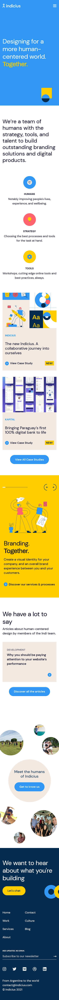

# Frontend Developement 21/22

# Procesverslag
Markdown is een simpele manier om HTML te schrijven.  
Markdown cheat cheet: [Hulp bij het schrijven van Markdown](https://github.com/adam-p/markdown-here/wiki/Markdown-Cheatsheet).

Nb. De standaardstructuur en de spartaanse opmaak van de README.md zijn helemaal prima. Het gaat om de inhoud van je procesverslag. Besteedt de tijd voor pracht en praal aan je website.

Nb. Door *open* toe te voegen aan een *details* element kun je deze standaard open zetten. Fijn om dat steeds voor de relevante stuk(ken) te doen.

## Jij

uitwerken voor kick-off werkgroep

### Auteur:
Thomas Groeneweg

#### Je startniveau:
Rood

#### Je focus:
Responsive
 

## Je website

W0

### Je opdracht:
https://indicius.com/

#### Screenshot(s) van de eerste pagina (small screen): 

 Homepage 

#### Screenshot(s) van de tweede pagina (small screen):

 Projectpagina 

 

## Breakdownschets (week 1)

uitwerken na afloop 2e werkgroep

### de hele pagina: 

### dynamisch deel (bijv menu): 

## Voortgang 1 (week 2)

 
Het begin is er; het grootste deel van het werk van de eerste pagina is gedaan. Section 5 (We have a lot to say) zou geen probleem moeten zijn (het is praktisch hetzelfde als 4), 6 (Meet the Humans) word wel even kloten met animaties (en javascript, on scroll/position) en 7 (Footer) is puur Flexbox. Ik heb nog niet echt naar het menu gekeken, maar dat komt wel goed nu m'n basis JS weer op orde is. Bij section 4 (Carousel) word het wel even uitzoeken hoe ik tekst alleen toon binnen de container met animaties op een timer EN op commando.
 

### Stand van zaken
Zie bovenstaande! Goed op weg, maar genoeg te doen. Het is vooral animeren en JS voor deze pagina nu. Ik verwacht begin volgende week te beginnen met de tweede pagina, als het een beetje mee zit.
 
 ### Huidige voortgang: 
 
 

### Agenda voor meeting
samen met je groepje opstellen

| student 1      | student 2          | student 3    | student 4        |
| ---            | ---                | ---          | ---              |
| dit bespreken  | en dit             | en ik dit    | en dan ik dat    |
| en dat ook nog | dit als er tijd is | nog een punt | dit wil ik zeker |
| ...            | ...                | ...          | ...              |

### Verslag van meeting
hier na afloop snel de uitkomsten van de meeting vastleggen

- punt 1
- punt 2
- nog een punt
- ...

## Voortgang 2 (week 3)

uitwerken voor 2e voortgang

### Stand van zaken
Positief: Grid weer onder de knie, flexbox gaat ook weer steeds makkelijker. De eerste animaties zitten er in, maar @keyframes missen nog. Het laatste lastigere van de eerste pagina is op dit moment in behandeling, en de laatste sectie is zo gedaan.
 
Minder leuk: Delen van de code heb ik overnieuw moeten schrijven omdat grid simpelweg fijner werken is als je de vormgeving wilt laten leiden. Ik heb minder voortgang kunnen maken dan ik had gehoopt, maar deze week heb ik wel weer tijd genoeg om er aan te werken.
 
Aandachtpuntjes:
 > Ik moet echt een systeem bedenken hoe ik dingen wil gaan groeperen. Nu doe ik het op de volgorde waarin het in me op komt en schuif even wat lijntjes als het werkt - wel redelijk consistent denk ik, maar een beetje een uniforme aanpak is wel wat handiger.
 > JS zit nu nog niet in de code (maar ik weet wel hoe het moet - iig de drie regels, zal later moeten kijken naar de carousel en misschien sectie 5).
 
 To ask:
 > Hoe zit het met EM/REM en de meegegeven font-sizes (hoe heeft dat invloed)?
 > Mag ik nou wel of niet die div's gebruiken? Het is vorige week ook aangekaart, maar heb er niks meer over gehoord van de SA. :) Wil ze best vervangen door lists/list items, maar het is maar de vraag of dat nou zo nuttig is.
 > Is het mogelijk om .svg binnen de  tag ook aan te passen met CSS, of moet ik dan echt de pure SVG's in de code plakken? En zo ja, hoeveel van die geexporteerde code is er echt nodig?
 
 To do still:
 > Menu verwerken, @keyframes toepassen (en opdracht afmaken) en beginnen met de tweede pagina. Oh, en het opschonen van de code. Zit nu echt een beetje met sizing issues - het lijkt vaak niet consistent te kunnen zijn met de globale regels.

### Verslag van meeting
hier na afloop snel de uitkomsten van de meeting vastleggen

- punt 1
- punt 2
- nog een punt
- ...

## Toegankelijkheidstest (week 4)

uitwerken na test in 8e voortgang

### Bevindingen
Lijst met je bevindingen die in de test naar voren kwamen:

#### Titel eerste bevinding
Hier korte omschrijving (met indien nodig een afbeelding)

Hier een omschrijving van hoe het opgelost kan worden (met indien nodig een afbeelding)

#### Titel tweede bevinding. 
Hier korte omschrijving (met indien nodig een afbeelding)

Hier een omschrijving van hoe het opgelost kan worden (met indien nodig een afbeelding)

#### Titel volgende bevinding. 
Hier korte omschrijving (met indien nodig een afbeelding)

Hier een omschrijving van hoe het opgelost kan worden (met indien nodig een afbeelding)

#### Titel nog een bevinding. 
Hier korte omschrijving (met indien nodig een afbeelding)

Hier een omschrijving van hoe het opgelost kan worden (met indien nodig een afbeelding)

## Voortgang 3 (week 4)

uitwerken voor 3e voortgang

### Stand van zaken
hier dit ging goed & dit was lastig (neem ook screenshots op van delen van je website en code)

### Agenda voor meeting
samen met je groepje opstellen

| student 1      | student 2          | student 3    | student 4        |
| ---            | ---                | ---          | ---              |
| dit bespreken  | en dit             | en ik dit    | en dan ik dat    |
| en dat ook nog | dit als er tijd is | nog een punt | dit wil ik zeker |
| ...            | ...                | ...          | ...              |

### Verslag van meeting
hier na afloop snel de uitkomsten van de meeting vastleggen

- punt 1
- punt 2
- nog een punt
- ...

## Eindgesprek (week 5)

uitwerken voor eindgesprek

### Stand van zaken
hier dit ging goed & dit was lastig (neem ook screenshots op van delen van je website en code)

### Screenshot(s)

hier screenshot(s) van je eindresultaat

## Bronnenlijst

continu bijhouden terwijl je werkt

Nb. Wees specifiek ('css-tricks' als bron is bijv. niet specifiek genoeg).

1. bron 1
2. bron 2
3. ...

